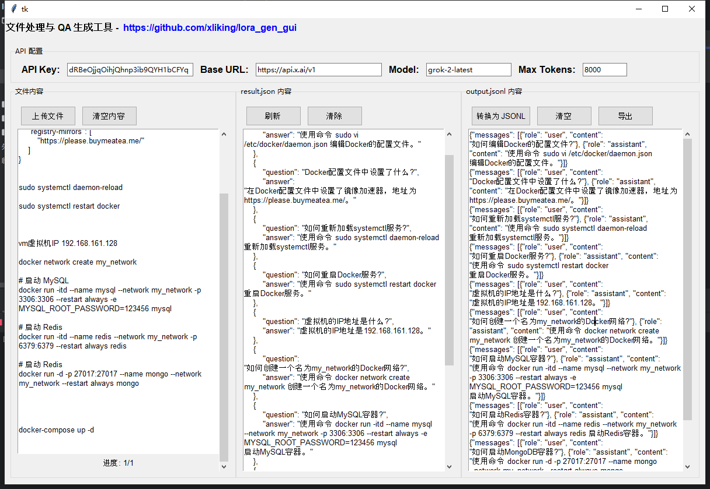

# 文件处理与 QA 生成工具

这是一个基于Python的GUI工具，用于从各种文档中提取内容，并使用AI生成相应的问题和答案对。该工具支持多种文件格式，并能将生成的QA对导出为JSONL格式，适用于AI模型的微调训练。

## 功能特点

- **多格式文件支持**：支持TXT、DOCX、XLSX和PDF文件格式
- **AI驱动的QA生成**：使用AI模型从文本内容中自动生成问题和答案
- **并行处理**：使用多线程处理大型文档，提高效率
- **JSON/JSONL转换**：将生成的QA对保存为JSON格式，并支持转换为AI训练用的JSONL格式
- **用户友好界面**：简洁直观的GUI界面，易于操作

## 安装要求

```
pip install python-docx pandas PyPDF2 openai tkinter
```

## 使用方法

1. **配置API**：
   - 填写API Key、Base URL、Model名称和Max Tokens
   - 默认配置为X.AI的API

2. **上传文件**：
   - 点击"上传文件"按钮选择要处理的文档
   - 支持的格式：TXT、DOCX、XLSX、PDF

3. **生成QA对**：
   - 程序会自动将文档分段处理
   - 使用AI为每个段落生成相关的问题和答案
   - 生成的QA对会实时显示在中间面板并保存到result.json

4. **转换为JSONL**：
   - 点击"转换为JSONL"按钮将JSON格式转换为JSONL格式
   - JSONL格式适用于AI模型的微调训练

5. **导出结果**：
   - 点击"导出"按钮将JSONL内容保存到本地文件

## 界面说明

- **左侧面板**：显示上传文件的内容和处理进度
- **中间面板**：显示生成的JSON格式QA对
- **右侧面板**：显示转换后的JSONL格式内容

## 工作原理

1. 程序读取上传的文档内容
2. 将文档内容分割成适当大小的段落
3. 使用AI模型为每个段落生成问题和答案
4. 将生成的QA对保存为JSON格式
5. 根据需要转换为JSONL格式并导出

## 注意事项

- 确保填写正确的API配置信息
- 处理大型文档时可能需要较长时间
- Max Tokens参数影响AI生成内容的长度限制
- 生成的QA对质量取决于AI模型和原始文档的质量

## 项目链接

访问[GitHub项目页面](https://github.com/xliking/lora_gen_gui)获取最新版本和更多信息。